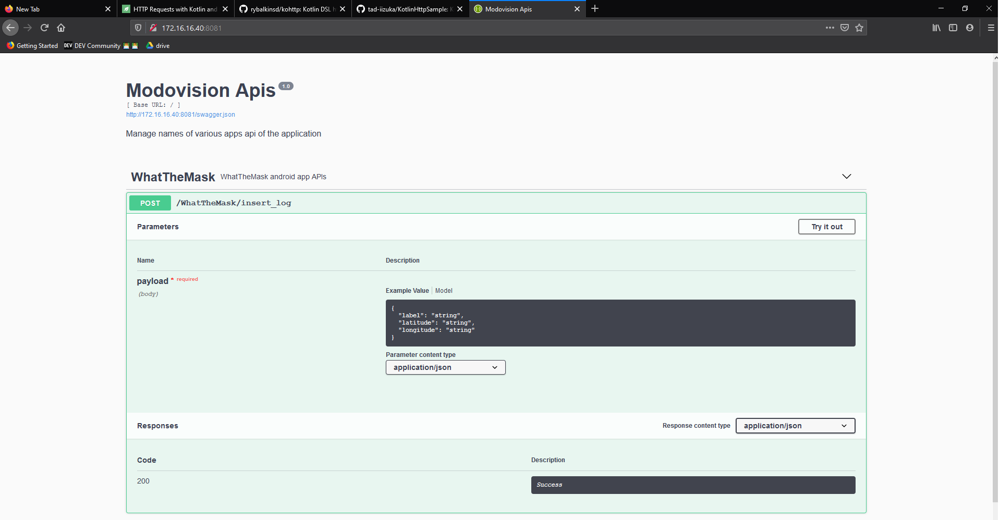

# [Modovision api](http://172.16.16.40:8081)

--
- [x] /WhatTheMask/insert_log (token required)
- [x] /auth/token (key required, and generate token)
- [x] token expired
- [x] UI with nginx
- [x] docker-compose.yaml
- [x] nginx save logs